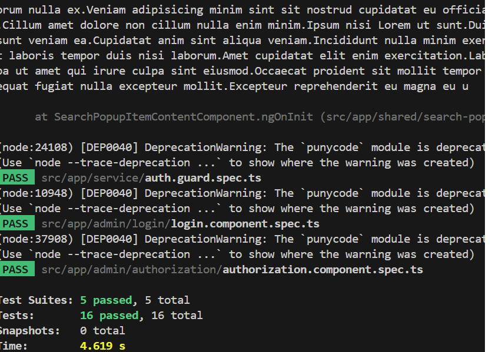

# Eclinic

This project was generated using [Angular CLI](https://github.com/angular/angular-cli) version 18.2.0.

## Running Unit Tests

Execute `npm run test` to run unit tests via Jest.
Tested:

- Login component
- Authorizaiton component
- Auth guard

## Running End-to-End Tests

Run `npx cypress open` to perform end-to-end tests using Cypress.

## Supporting Multiple Backends

Set the appropriate `BaseURL` value in `env.js`.

```javascript
window.__env.BaseURL = "http://localhost:5215";
```

The backend code for this project is located at:[Here](https://github.com/cxxyao2/HealthCenterBackend.git).

## Sharing data Models between Frontend and Backend

Share services and data models through `openapicli` tools. This significantly reduces conflicts and errors. Execute the `generate-client-sdk` command in `package.json`:

```bash
"generate-client-sdk": "openapi-generator-cli generate -i http://localhost:5215/swagger/v1/swagger.json -g typescript-angular -o src/libs/api-client --skip-validate-spec --type-mappings DateTime=Date,object=any"
```

Then , importing the elements from `src/libs/api-clients' like this:

```
import { AuthService } from '@libs/api-client';
```

## Internationalization (i18n)

Use the `@jsverse/transloco` package for a simple and elegant approach to implement internationalization.

In component.ts file,

```
import {translocoDirective} from '...'
...
@Component({
    imports:[{...,translocoDirective,...}]
)}
```

In template file, wrap the content with transloco directive

```
<div *transloco="let t">
       <div>{t('your-translate-key')}
</div>
```

## Notifications

Use Server-Side Events to receive notifications from the backend.

## Authorization and Authentication

Role-based authorization. Only administrators can create schedules for practitioners. Authentication is based on JWT using an access token and a refresh token.

## From desktop to cloud-native

Years ago, I developed numerous management systems using VB, PowerBuilder, and VB.NET. Now, I have replicated a small hospital management system using Angular and C#. However, I did not implement the billing module, as it involves complex scenarios related to self-payment and medical insurance.

Compared to desktop applications, cloud applications are scalable, accessible, and resilient—enabling better flexibility, remote access, and high availability.

The Hospital Management System (HMS) is a comprehensive software solution designed to simulate the operations of a small hospital, providing efficient workflow management for administrators, doctors, nurses, and patients. The system includes the following core functionalities:

1. **Doctor Scheduling** – Administrators can assign and manage doctors’ shifts, ensuring proper coverage for patient care.
2. **Patient Appointment Management** – Patients can book appointments with doctors through an intuitive ordering system.
3. **Check-in & Waiting List** – Upon arrival, patients check in, and their status is updated on a real-time waiting list for doctors to manage consultations.
4. **Consultation & Prescription Management** – Doctors conduct patient consultations, diagnose conditions, and prescribe medications.
5. **Inpatient Admission & Bed Management** – If hospitalization is required, nurses can assign and manage bed availability within the system.
6. **User Role Management** – Administrators can assign roles and permissions to users, ensuring secure and role-based access control.
7. **Reporting & Analytics** – The system provides statistical reports on hospital operations, including appointment trends, doctor workload, and patient flow analytics.

The HMS is built to enhance hospital efficiency, streamline patient care workflows, and provide administrators with the necessary tools for effective hospital operations. It supports role-based access control (RBAC) to ensure security and compliance while offering real-time data tracking and reporting for informed decision-making.

## Screenshots of Main Features

- Authorization
  
- Make shifts
  
- Book appointments
  
- Check in
  
- Waiting
  
- Consulation
  
- Inpatient Admission && Bed management
  
  
- Internationization ( English <=> Frenh)
  
- E2E test
  
- Unit test
  
